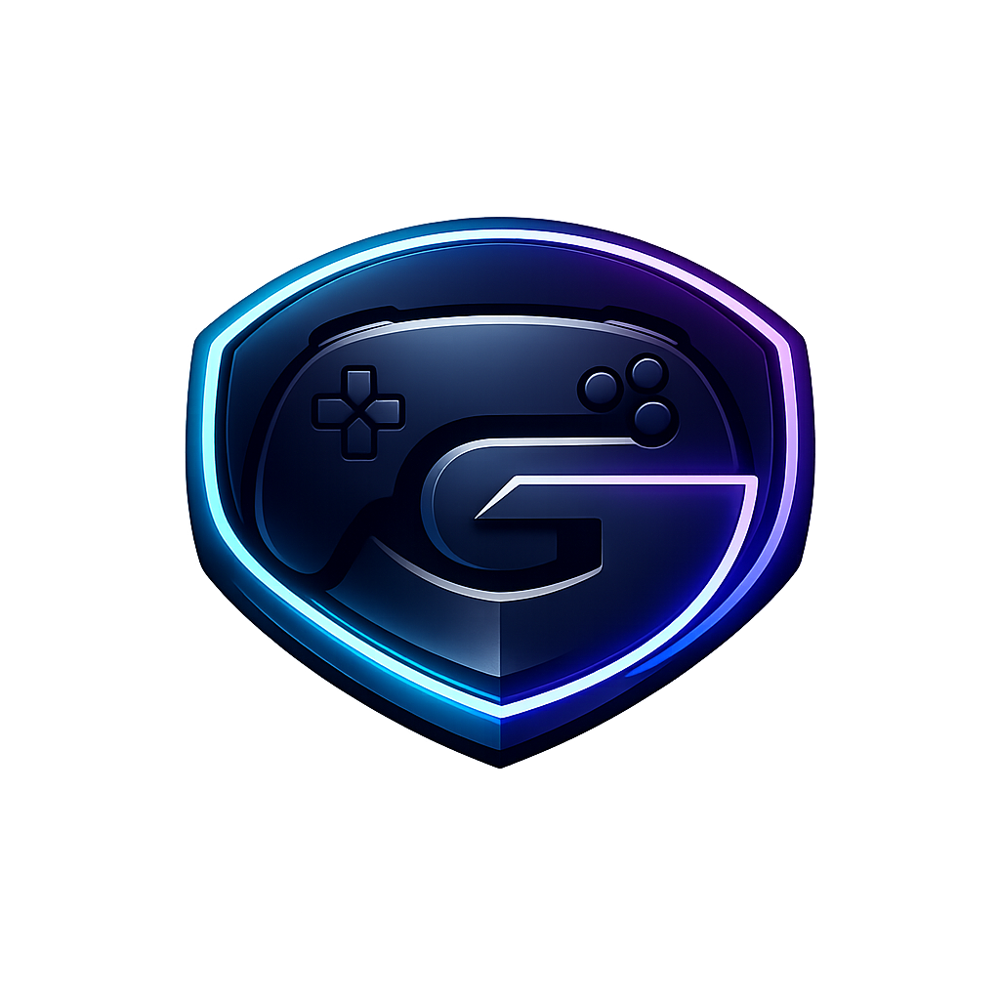
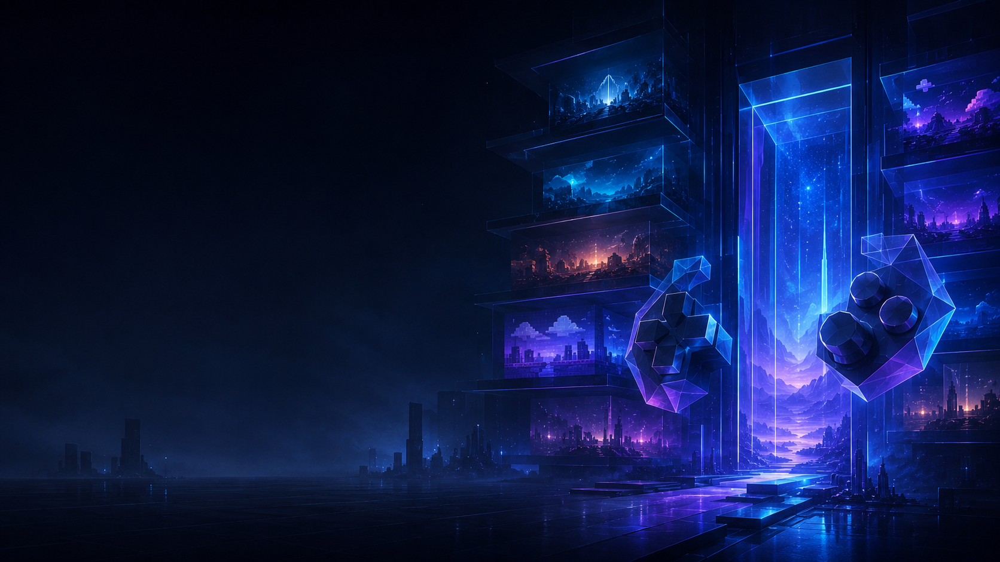
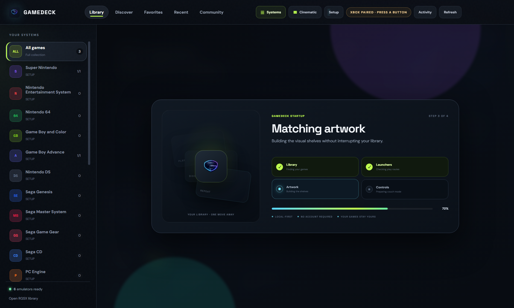
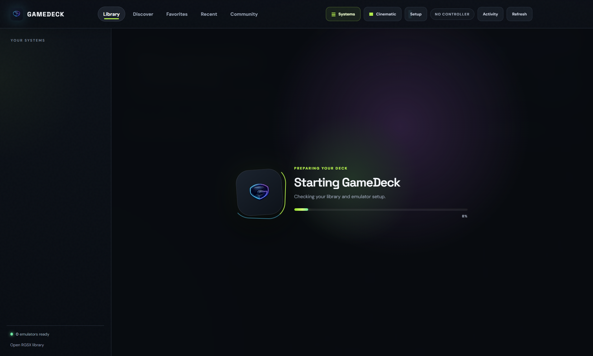

<p align="center">
  
</p>

<h1 align="center">GameDeck</h1>

<p align="center"><strong>Your legally owned game library, presented like the main event.</strong></p>

<p align="center"><a href="https://www.youtube.com/playlist?list=PLG-ejeCsa-AI"><strong>Start here</strong></a> · <a href="https://www.youtube.com/playlist?list=PLCbffYifS8R8">Watch the 30-second tours</a> · <a href="https://youtu.be/vY-fFVu2ClM">Full tutorial</a> · <a href="docs/E2E_REPORT_1.2.0.md">E2E report</a></p>

<p align="center">
  <a href="https://b11-health.github.io/gamedeck/"><strong>Download GameDeck</strong></a> ·
  <a href="https://youtu.be/0nCHy9WsEpQ">Watch the trailer</a> ·
  <a href="https://github.com/B11-Health/gamedeck/discussions">Join the community</a>
</p>

<p align="center">
  <a href="https://github.com/B11-Health/gamedeck/actions/workflows/ci.yml"></a>
  <a href="LICENSE"></a>
  
</p>



GameDeck is a cinematic, controller-first desktop launcher for local game collections. It scans files already on your machine, matches each title to a configured emulator, shows clear setup diagnostics, and keeps downloads or archive preparation visible without turning the interface into a file manager.

GameDeck does **not** include ROMs, BIOS files, encryption keys, or commercial game artwork. Bring only games and firmware you are legally entitled to use.

## Highlights

- One local-first library across Windows, macOS, and Linux
- Controller, keyboard, and mouse navigation
- Preview-on-click cards with deliberate Play, Enter/A, or double-click activation
- Input-aware help that adapts instantly to pointer, keyboard, or controller use
- A two-tier responsive header that separates navigation, live actions, and operational status without crowding
- Live device-path health with clear required, optional, unsaved, and restart states
- Native GameDeck Live screen/game capture with dependency-free Chromium WebRTC and local mobile receivers
- Remote Play Together for games such as Street Fighter II, Contra, and Smash TV: the host streams the game while friends join as native RetroArch P2–P4 controllers
- Unified multiplayer command center with couch co-op, encrypted Remote Play, relay-backed synchronized netplay, setup-aware recommendations, live player slots, and local ROM/core match IDs
- One-click installers with a bundled, verified RetroArch runtime and compatible core set; no separate emulator installer for supported systems
- Validated multi-disc Saturn `.m3u` playlists that reject missing disc members before launch
- Dedicated MAME and FinalBurn Neo catalog handling with pre-launch ROM-set health checks
- One-click launch doctor that resolves shared BIOS/parent files, validates the best available arcade route, and resumes launch automatically
- Managed repair-on-play for damaged RGSX arcade archives with no manual file handling
- Full arcade names and local year, manufacturer, player, button, and control metadata from installed MAME
- Scoped Xbox/XInput arcade profiles that preserve global emulator settings
- BIOS-aware readiness checks with real setup locations
- Cinematic title details, artwork caching, favorites, and recent plays
- Exact No-Intro filename matching, revision aliases, Libretro CDN fallback, indexed fuzzy title matching, and quiet background cover enrichment
- Premium GameDeck-original posters for trustworthy no-source, homebrew, or unofficial exceptions
- A calm four-stage startup panel that reports library, launcher, artwork, and control readiness
- Context-aware hero actions for continuing a recent game, choosing a surprise title, or finishing setup
- Immediate launch feedback and visible metadata-source continuity in the selected-game spotlight
- Remembers focus and scroll position independently across Library, Favorites, Recent, and console shelves
- Per-console Discover memory with Available, Downloaded, and In Library filters
- A built-in ready check for library, launcher, artwork, and controller setup
- One-click **Surprise me** picks a random playable title from the current shelf
- Manual cover correction and one-click metadata refresh for titles that need a better match
- Automatic local sidecar metadata (`Game Name.json`, `.metadata.json`, or `metadata/`) plus expanded `boxart`, `covers`, and `media` artwork discovery
- A prominent, transparent in-app support center for direct donations and founding sponsorships
- Responsive shelf-first layouts that adapt cleanly from the minimum desktop window through large displays
- Sticky library controls, precise keyboard focus, artwork-quality filtering, and visible readiness states
- Explicit clear-search affordance and immediate refresh/scanning feedback
- Hierarchical selected-game actions with Play, favorite, cover replacement, metadata refresh, and safe move-to-Trash removal
- Collapsible systems rail and persistent title, recency, console, or size sorting
- Persistent resumable transfers with saved progress, Pause, Resume, retry, verification, extraction, speed, and ETA states
- Actionable transfer completion, issue routing, and dismissible finished items
- Structured Status Center with issue filters, grouped events, and copyable diagnostics
- Optional RGSX Discover integration when its local provider is available; core library play does not depend on RGSX
- Privacy-respecting community sponsor placements with a user opt-out
- Public donation addresses only; wallet secrets are never part of the app

## Startup without the fake wait

GameDeck no longer hides startup behind a spinning logo. The boot panel advances through four concrete stages—game engines, library, artwork, and controls—then gets out of the way. Progress remains readable, local-first, and honest even when a large collection takes longer to scan.



## Ready without the guesswork

GameDeck explains exactly what is ready and what still needs attention. The in-app ready check scans the library, compatible launchers, artwork coverage, and controller support, then offers a direct path to the relevant setup screen. Press **X** on a standard controller or choose **Surprise me** to jump to a random playable game.

Selected games expose **Artwork**, **Details**, and **Remove** actions. Remove uses the operating system Trash or Recycle Bin rather than permanently deleting the game immediately.



## Multiplayer command center

Select a game and choose **Multiplayer**, press **M**, or press **Start** on a standard controller. GameDeck presents Couch Co-op, Remote Play Together, and Synchronized Netplay as distinct choices with game, core, and controller readiness shown before launch.

The command center recommends the best route for the current setup, shows every player slot before launch, copies game/core match IDs, and can read a pasted `GDREMOTE2`, `GDREMOTEANSWER2`, or `GDPLAY1` code from the clipboard and route it to the correct join screen. Once a room is live, setup controls collapse into a focused lobby that remains fully visible at standard desktop sizes.

For Remote Play Together, select a supported local multiplayer game and choose **Remote Play**. GameDeck launches the host game with RetroArch's native Remote RetroPad input enabled, starts the GameDeck Live capture pipeline, and creates a short-lived `GDREMOTE2` invitation for a selected player slot. Send that invitation through Discord or another private channel. The friend pastes it into **Join a friend**, creates a `GDREMOTEANSWER2` response, and sends the response back to the host. Once the host accepts it, encrypted WebRTC video/audio and controller input connect directly between the two computers.

Only the host needs the game. GameDeck does not transfer the ROM, BIOS, save files, or game metadata to the guest. Standard browser gamepads are mapped to RetroPad buttons; keyboard fallback uses arrows, `Z`, `X`, `A`, `S`, `Enter`, and `Shift`. Each invitation expires after 20 minutes and is bound to one player slot and session token.

GameDeck uses public STUN discovery for direct peer-to-peer connectivity and does not require OBS, a streaming SDK, or a GameDeck cloud account. Some highly restrictive carrier, corporate, or symmetric-NAT networks cannot establish a direct WebRTC path without TURN relay infrastructure. For Synchronized Netplay, both players need the same game revision and compatible core build. GameDeck calculates SHA-256 identifiers locally, verifies them before joining, and creates a temporary relay invitation without uploading game files. See the [multiplayer guide](docs/MULTIPLAYER.md).

See [Remote Play architecture and troubleshooting](docs/REMOTE_PLAY.md).

## Install

Download the appropriate artifact from [Releases](https://github.com/B11-Health/gamedeck/releases):

- Windows: NSIS installer or portable `.exe`
- macOS: universal `.dmg` or `.zip` for Intel and Apple Silicon
- Linux: `.AppImage` or `.deb`

Early unsigned builds may trigger operating-system warnings. Production signing and Apple notarization are tracked in the [release guide](docs/CROSS_PLATFORM.md).

### One install, complete runtime

Release packages carry the verified RetroArch application, compatible core bundle, and archive-extraction helper inside the GameDeck installer. On first launch, GameDeck installs these included components into its own private runtime directory without requiring a second installer or a network connection. If a development or reduced package does not carry the cache, GameDeck falls back to approved HTTPS sources with resumable partial files, automatic retry, and SHA-256 verification.

Game downloads and preparation jobs persist across restarts. Interrupted transfers return as **Paused** with their saved progress and can be resumed from the transfer dock. Selected games can be moved safely to the operating system Trash or Recycle Bin from the spotlight.

GameDeck never bundles commercial games or copyrighted console firmware. BIOS-dependent systems guide the user to import firmware they legally own. RGSX is an optional Discover and managed-repair provider, not a dependency for normal library playback. Standalone emulators remain preferred when already configured, while the included RetroArch routes cover supported systems. Wii U still requires a separately installed compatible emulator.


## Development

Requirements: Node.js 20 or newer and npm. GameDeck can provision its managed runtime during development, or use an existing supported emulator.

```bash
git clone https://github.com/B11-Health/gamedeck.git
cd gamedeck
npm ci
npm start
```

Useful commands:

```bash
npm test          # syntax, DOM contract, portability, and asset smoke checks
npm run pack      # cache the full current-OS runtime, then build the unpacked app
npm run dist:win  # Windows installer + portable build
npm run dist:mac  # universal macOS DMG + ZIP (run on macOS)
npm run dist:linux
```

GameDeck uses its bundled managed runtime by default in release packages and also checks common emulator and library locations. Open **Community → This device** only to override the game library, optional Discover provider, RetroArch executable, cores, or system/BIOS paths. Path changes apply after restart.

### Arcade libraries

The Arcade Command Center verifies ZIP/7z integrity, uses native MAME verification where it is authoritative, and keeps FinalBurn Neo as the preferred route for compatible sets. Missing shared system files are installed through RGSX and the original launch resumes automatically. Damaged managed archives can be replaced, re-audited, and launched from the same click; untrusted files without a repair source remain blocked. Read the [arcade setup guide](docs/ARCADE.md) for compatible set layouts, BIOS/parent lookup, Xbox mappings, artwork folders, and troubleshooting.

### Keyboard shortcuts

- `/` focuses library or catalog search
- `M` opens the multiplayer command center
- `Ctrl+B` toggles the systems rail
- Arrow keys move between systems and games; `Enter` launches the focused title
- <code>`</code> opens the activity console; `Escape` backs out or clears search

Environment overrides are also supported: `GAMEDECK_LIBRARY`, `GAMEDECK_RGSX_ROOT`, `GAMEDECK_EMULATION_ROOT`, `GAMEDECK_RETROARCH`, `GAMEDECK_RETROARCH_CORES`, `GAMEDECK_RETROARCH_SYSTEM`, `GAMEDECK_MAME`, `GAMEDECK_DUCKSTATION`, `GAMEDECK_PCSX2`, `GAMEDECK_PPSSPP`, `GAMEDECK_DOLPHIN`, and `GAMEDECK_CEMU`.

## Community

- Join the official [GameDeck Discord community](https://discord.gg/eS7d4VqTT) for Remote Play sessions, support, announcements, and showcases.
- Use the [growth playbook](docs/GROWTH_PLAYBOOK.md) and [platform-ready social kit](marketing/social/README.md) for respectful, evidence-led community outreach.
- GameDeck links directly to `#remote-play`, `#support`, `#announcements`, and `#showcase` from the Community screen. See the [Discord community playbook](docs/DISCORD_COMMUNITY.md).
- Remote Play can prepare a Discord-safe, paste-ready invite or response and open `#remote-play` without exposing ROMs, firmware, or save files.
- Read [CONTRIBUTING.md](CONTRIBUTING.md) before opening a pull request.
- Check the [roadmap](ROADMAP.md) and [open issues](https://github.com/B11-Health/gamedeck/issues).
- Use the [arcade community launch kit](docs/COMMUNITY_LAUNCH.md) for evidence, screenshots, channel rules, and outreach sequencing.
- Report security problems privately using [SECURITY.md](SECURITY.md).
- See [FUNDING.md](FUNDING.md) and the transparent [sponsorship policy](docs/SPONSORSHIP.md).

GameDeck is not affiliated with Nintendo, Sony, Microsoft, Sega, Valve, RetroArch, or emulator projects referenced for compatibility. Product names belong to their respective owners.

## Video and channel launch

Watch the public [GameDeck official motion launch trailer](https://youtu.be/0nCHy9WsEpQ) and follow [@PlayGameDeck on YouTube](https://www.youtube.com/@PlayGameDeck).

The validated 1080p motion master is available at [marketing/youtube/GameDeck-Official-Launch-YouTube.mp4](marketing/youtube/GameDeck-Official-Launch-YouTube.mp4), with source motion capture, Gemini narration, captions, channel artwork, and reproducible capture/render scripts. Full production details and licensing notes are in [docs/YOUTUBE_LAUNCH.md](docs/YOUTUBE_LAUNCH.md).
