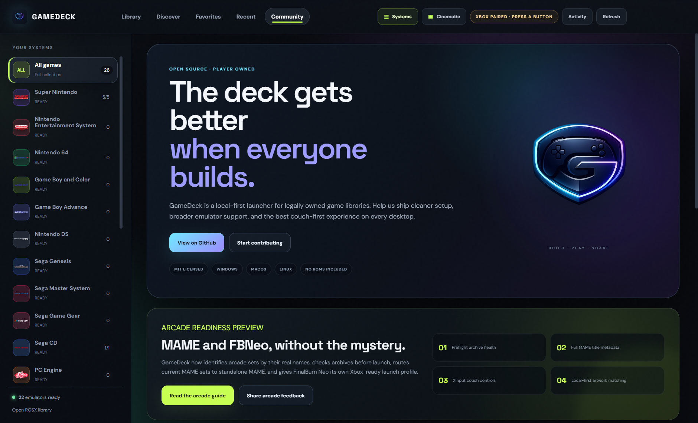

# GameDeck arcade community launch kit

This kit is for a measured public preview of GameDeck's new MAME and FinalBurn Neo experience. The objective is to recruit useful testers and contributors, not to mass-post promotional links.

## Proof before promotion

The August 1, 2026 Windows QA run found 12 local arcade sets: 11 archives passed preflight and one deliberately preserved damaged archive failed. The healthy FinalBurn Neo launch probe reached driver initialization and gameplay startup. The damaged archive was identified as truncated and blocked before launch. Standalone MAME 0.288 was detected and its native title database and verifier were integrated; no compatible standalone-MAME game was available locally for a full gameplay launch test.

Public claims should stay inside that evidence. Do not claim universal compatibility, automatic BIOS repair, or a successful standalone-MAME gameplay test.

Recommended visual assets:

- `screenshots/arcade-command-1500x900-final.png` — primary feature overview
- `screenshots/arcade-attention-1500x900.png` — transparent failure-state proof
- `docs/images/community-arcade-update.png` — copyright-clean brand and release visual
- `assets/branding/gamedeck-hero.png` — copyright-clean brand visual
- `assets/branding/gamedeck-mark-source.png` — transparent project mark

Before attaching a UI screenshot publicly, check that no private paths, account details, or unlicensed downloadable files appear. Commercial game artwork shown by a user's local metadata provider must not be added to the application bundle or represented as GameDeck-owned.

## Channel plan

### 1. GitHub Discussions — recommended first

GitHub describes Discussions as the repository's open-ended space for announcements, questions, and direction-setting. Enable Discussions, create an **Announcements** category if necessary, publish the post below, and pin it. Keep concrete defects in Issues.

**Title**

> Arcade readiness preview: MAME + FBNeo health checks and Xbox controls

**Body**

> GameDeck's arcade shelf now treats ROM sets as versioned collections instead of generic files.
>
> The preview adds pre-launch ZIP/7z integrity checks, native `MAME -verifyroms` results where applicable, full display names from the installed MAME database, standalone-MAME routing for current sets, a dedicated FinalBurn Neo controller profile, and local-first artwork matching.
>
> The important behavior is the failure path: an unsafe set is blocked with the real reason, while healthy games remain available. GameDeck never responds to a failed launch by silently downloading or replacing a user's files.
>
> Our first Windows validation run covered 12 owned local sets: 11 archives passed preflight and one truncated archive was correctly stopped. A healthy FBNeo title reached gameplay startup. Standalone MAME 0.288 detection, metadata, and verification are covered; broader native-MAME gameplay testing is the next community target.
>
> We would value focused feedback on:
>
> 1. split and merged set messaging;
> 2. two-player Xbox mappings;
> 3. Linux/macOS standalone-MAME discovery;
> 4. local flyer, cabinet, marquee, and snapshot matching; and
> 5. accessibility of the health states.
>
> Start with the [arcade setup guide](https://github.com/B11-Health/gamedeck/blob/main/docs/ARCADE.md), then open an issue with the emulator/core version, arcade short name, set layout, and exact health-check message. Do not upload or link ROMs or BIOS files.
>
> GameDeck is MIT licensed, local-first, and contains no ROMs, BIOS files, encryption keys, or commercial game artwork.

### 2. Reddit — moderator-first and human-written

Do not paste AI-authored launch copy into the target subreddits:

- `r/emulation` says text or images created with generative AI are generally disallowed and expects self-posts to create wider discussion.
- `r/opensource` says all AI-generated content is low effort and ban-worthy; it also limits self-promotion and requires the **Promotional** flair for a project share.
- `r/MAME` prohibits promotion of products or services for profit and permanently bans ROM/CHD links. Because GameDeck has optional ads and donations, request moderator approval before mentioning the project there.
- `r/RetroArch` prohibits spam/advertising and crowdfunding posts without explicit approval. A technical feedback post must stay focused on the libretro/FBNeo integration and omit funding calls.

The maintainer should write the final post in their own words from this fact sheet:

- You built GameDeck because arcade files that look present can still fail for distinct reasons: corruption, missing parent/BIOS data, or a version mismatch.
- The interface now exposes that distinction before launch.
- It resolves MAME short names locally, prefers standalone MAME for current MAME sets, and uses a scoped RetroArch profile for FBNeo.
- A 12-set validation found 11 healthy archives and one truncated archive; the bad one was blocked without redownloading anything.
- You want critique on the error language, controller map, split/merged set representation, and cross-platform discovery.
- The repository is MIT licensed and contains no ROMs or BIOS files.

Ask each moderation team for permission first. One community-specific post is enough; do not cross-post identical text or send unsolicited private messages. Reddit's current spam guidance warns against repeated mass engagement and tells project owners to check community rules or contact moderators when unsure.

### 3. Medium — founder story, rewritten by the founder

Medium's policy allows AI-assisted outlines, but AI-generated writing must be disclosed and is not eligible for broad distribution in the same way as original human storytelling. Use the outline below as an interview guide. The founder should rewrite it with first-hand details, screenshots, and personal judgment before publishing.

**Working title:** *The arcade file existed. Why would the game not start?*

1. Open with one real moment when an arcade title looked ready but failed.
2. Explain the three failure classes in plain language: damaged container, missing dependency, wrong set/runtime pairing.
3. Show the old retry-loop problem and the design principle that replaced it: diagnose, preserve, explain.
4. Walk through the Arcade Command Center and Xbox couch flow with two screenshots.
5. Describe the 12-set QA run, including the limitation that native MAME gameplay still needs broader testing.
6. Explain the legal boundary: GameDeck organizes a user's owned files and ships no ROMs, BIOS, keys, or commercial artwork.
7. End with one concrete contributor request rather than a generic promotional call.

If any generated wording or generated images remain, follow Medium's disclosure and caption requirements. Do not paywall AI-generated writing.

## Thirty-day cadence

| Timing | Action | Success signal |
|---|---|---|
| Day 0 | Merge the arcade PR, publish the guide, enable Discussions, and pin the announcement | First reproducible external setup report |
| Days 2–4 | Ask relevant Reddit moderators whether a human-written technical post is welcome | Explicit permission or a clear no |
| Week 1 | Publish one approved, community-specific post and stay available to reply | Detailed comments, not raw impressions |
| Week 2 | Founder publishes the revised Medium story and links back to the technical guide | Guide visits and completed setup reports |
| Week 3 | Post an evidence-based GitHub follow-up: fixes shipped, failures still open | Repeat testers and first-time contributors |
| Week 4 | Summarize metrics and choose one next milestone | Issues resolved, setup completion, return testers |

Track useful outcomes: unique testers, completed arcade scans, verified launches by runtime/OS, actionable issues, issue-to-fix time, and returning contributors. Do not optimize for raw impressions or identical cross-post volume.

## Publication checklist

- Release changes are merged and the linked guide resolves publicly.
- Claims match the QA evidence above.
- Screenshots contain no private data or bundled copyrighted assets.
- Every Reddit community's current rules have been checked again at submission time.
- The Reddit version is written by the human account owner.
- Medium text is substantially rewritten from first-hand experience and any retained AI assistance is disclosed.
- The account owner has reviewed the exact destination, title, body, image, and links before the final submit action.

## Policy references

- [Reddit spam policy](https://support.reddithelp.com/hc/en-us/articles/360043504051-Spam)
- [r/MAME rules](https://www.reddit.com/r/MAME/about/rules.json)
- [r/RetroArch rules](https://www.reddit.com/r/RetroArch/about/rules.json)
- [r/emulation rules](https://www.reddit.com/r/emulation/about/rules.json)
- [r/opensource rules](https://www.reddit.com/r/opensource/about/rules.json)
- [GitHub Discussions overview](https://docs.github.com/en/discussions/collaborating-with-your-community-using-discussions/about-discussions)
- [Medium AI content policy](https://help.medium.com/hc/en-us/articles/22576852947223-Artificial-Intelligence-AI-content-policy)
- [Medium distribution guidelines](https://help.medium.com/hc/en-us/articles/360006362473-Medium-s-Distribution-Guidelines-How-curators-review-stories-for-Boost-General-and-Network-Distribution)
